## Notes on Spring & Sprint Boot
###### - kjr
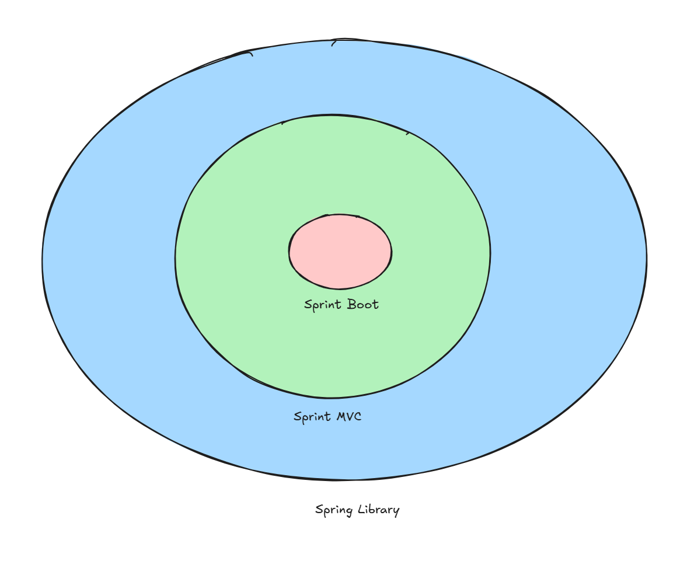

If Obj A need an Obj B
we create B first and inject into Obj A by contructor / methods

#### For Spring

<ul>It is done automatically by <b>annotation</b>
</ul>
<ul>
Spring creates the objects for you and passes them into constructors automatically.
</ul>

#### Spring Annotaiton

What an annotation is (in Spring terms)

##### In plain Java, an annotation is just metadata like:

'''
@Override
public void run() { }
'''

##### Spring Annotation

Spring uses its own annotations to tell the Spring container:

“This class should be managed by you. Please create it, store it, and inject it.”

So your earlier answer is correct:

✔ Spring needs annotations to know which classes to create.

Before Annotation lets talk about Beans first

### Beans
A Bean is an object that is instantiated, assembled, and managed by the Spring IoC container.

<ul>
It's just a regular Java class, but when the Spring container knows about it, we call it a Bean.

</ul>
<ul>
The container manages the entire lifecycle of this object, from creation to destruction.
</ul>

To tell Spring that a class should be a managed Bean, we use an annotation called a stereotype annotation. The most basic one is:

@Component: This is the generic stereotype annotation. Placing this on a class tells Spring: "Please create an instance of this class and manage it as a Bean in the ApplicationContext."

## Type Of Annotation:

Spring has different annotations for different types of components.

Here are the common ones you will learn:

@Component

@Service

@Repository

@Controller

@RestController

@Configuration

@Bean

@Autowired

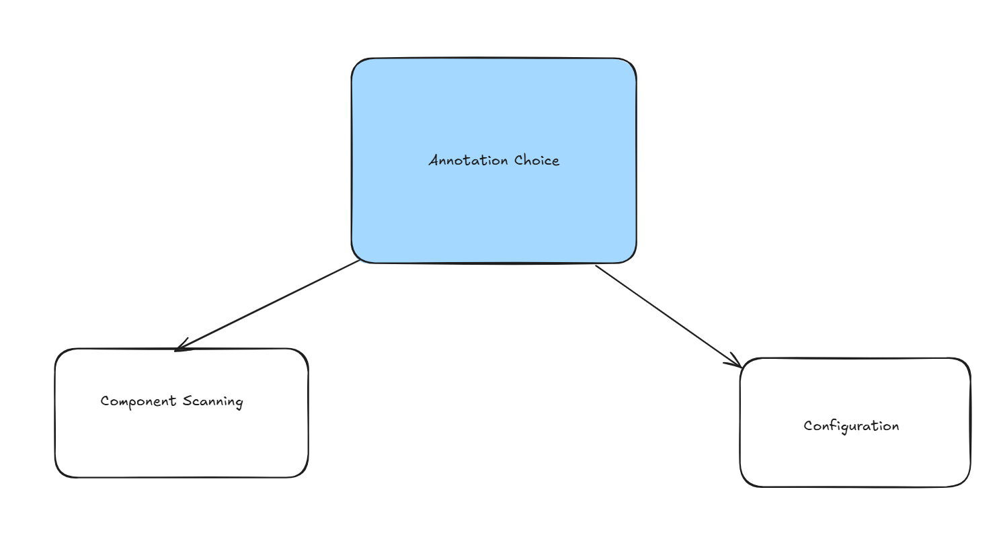

### 1- Stereotype Annotation

##### Stereotype Annotations (Specialized Components) 🧩
These annotations are all specializations of @Component. They don't change how the Bean is created, but they add semantic meaning to your code and enable specific framework features.

1. @Component: (Util class)
The generic annotation. Use this for any Spring-managed class that doesn't fit into a more specialized category (e.g., utility classes).    
    . 
2. @Service: (Business Logic)
📈 Marks a class that holds business logic. This is typically where the core rules and logic of your application reside, often calling methods in @Repository beans.
    . 
3. @Repository: (Database access)
💾 Marks a class that deals with data access (e.g., interacting with a database). Spring enables a useful feature called automatic exception translation for classes annotated with @Repository.
    . 
4. @Controller: (Handle client requests, return responses.)
💻 Marks a class in the presentation layer, specifically for handling incoming web requests (common in Spring MVC).
 

### 2. Configuration Annotations (Explicit Bean Creation) 🏭
These annotations provide an alternative, more explicit way to tell Spring how to create and configure a Bean, rather than relying on component scanning.

1. @Configuration: This annotation marks a **class** as a primary source of Bean definitions. Spring knows to process this class to find any methods annotated with @Bean.
.

2. @Bean: This annotation is placed on a **method** inside a **@Configuration class**. The return value of this method is registered as a Bean in the Spring container.
 

#### The key difference:

Stereotypes (@Component, etc.) are placed on the class itself, and Spring manages the standard constructor creation.

@Bean is placed on a method, allowing you to write custom Java logic to create and configure the object before it's given to the container.
 

### Code Example (Component Scanning)

##### Injecting Service into Controller
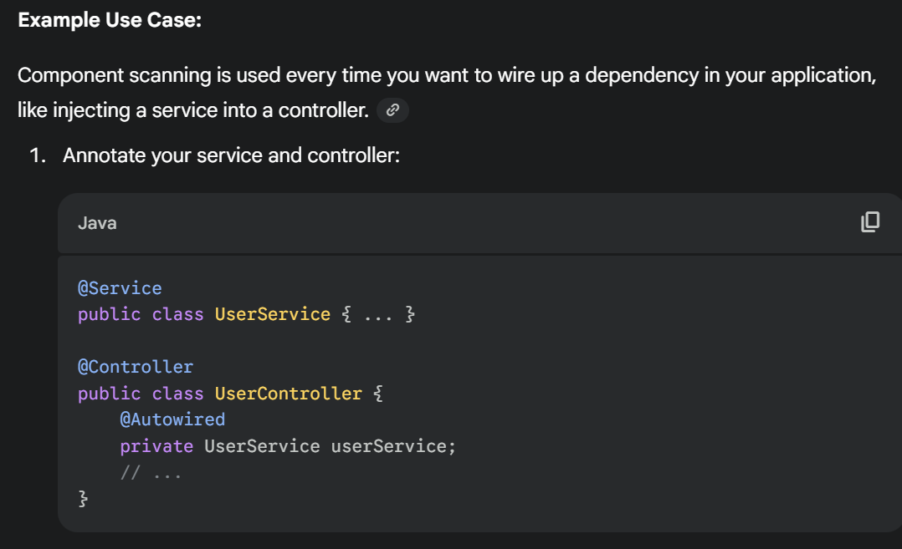

Steps
1. Defined a UserService class and tag with Service

2. Add a UserController class

3. Using @Autowired tag to let application context search for Userservice class. 

4. Define as private and save in an instance to use it.

## Application Context

#### Application Context - Spring container

The ApplicationContext is the centerpiece of Spring—it is the IoC container. Its primary responsibilities are:

1. Bootstrapping: It is the component that "turns the key" 🔑 to start the application. When it starts, it initiates the Component Scanning process to find all your beans.

2. Object Factory: It creates, configures, and assembles (wires) all the beans it finds via scanning and @Bean methods.

3. Lifecycle Management: It manages the entire life of every bean, from creation to destruction.
 

#### Bean Lifecycle Stages ⏳
When the container creates a Bean, it follows a specific sequence. This sequence is the Bean Lifecycle:

1. Instantiation: Spring creates an instance of the class (like calling new MyService()).

2. Population (DI): Spring injects the dependencies (the @Autowired fields) into the new instance.

3. Initialization: The Bean is given a chance to perform setup tasks (e.g., loading configuration data) via methods or interfaces like @PostConstruct.

4. Ready to Use: The Bean is now fully configured and stored in the container, ready to be injected into other components.
 

#### Type of Bean Scopes

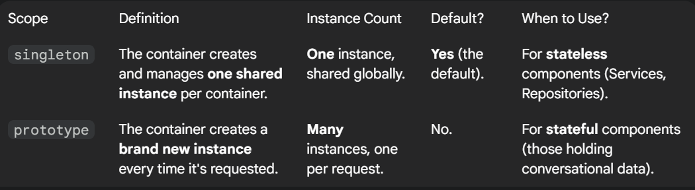

##### 1. Singleton (Default)

We need to ensure that our beans is **stateless** to prevent **race condition**.

1. Design your beans to be stateless
Eg. @Service and @Repository beans
2. Isolate with Threadlocal
3. Use Prototype

##### 2. Prototypes

Defined using @Scope("prototype")

Used when the beans is not stateless.

 

### Inversion of Control (IoC) - Design Principle

#### Spring IOC
Perfect example is Spring container

Where container as as factory to create the beans
We only need to inject the beans when needed

 

### NoUniqueBeanDefinitionException Error

When Spring encounters an @Autowired field and **finds multiple beans** that implement the required type in the ApplicationContext

Solution
1. Use Quanitfier
2. Use Primary
3. Change id of Bean
 

### Bean optimization
#### Eager and Lazy instantiation
1. Eager Instantiation (**Default**)
Eager instantiation means that an object is created and initialized as soon as the application starts up. 
Even if no part of the application has requested or used it yet.
.

2. Lazy Instantiation (by **@Lazy**)
Lazy instantiation (or "lazy loading") means that an object is created only when it is actually needed for the first time.
 

## Aspect Oriented Programming (AOP)

A complements of Object-Oriented Programming (OOP) by providing a way to handle concerns that affect multiple parts of an application.

In standard OOP, these concerns are scattered throughout the code (a problem known as code tangling). AOP solves this by letting you define the cross-cutting concern in one centralized place, called an Aspect.
 

## Annotations (High Level)

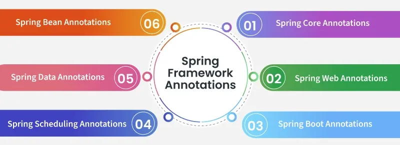

##### Check GFG. They provide a good high level support

https://www.geeksforgeeks.org/advance-java/spring-framework-annotations/

 

## How Code & Server connect

Summary of the Flow (For eg. code base with toy controller)
1. Start: FirstApiApplication.main() is called.

2. Container: The Spring Container is initialized.

3. Discovery: @SpringBootApplication initiates scanning and finds the @RestController in the sub-package.

4. Wiring: The controller is instantiated and registered as a Bean.

5. Listen: The container starts an embedded web server (like Tomcat), which listens for incoming requests.

Response: When a client hits http://localhost:8080/, the container directs the request to the hello() method, and the string "Hello First API" is returned as the HTTP response body.
 

### Request Mapping
Which is how Spring Web MVC framework **directs** incoming **HTTP requests** to the correct controller method.

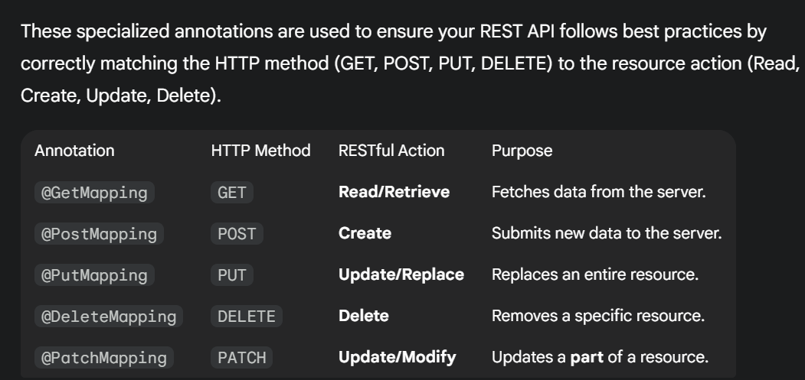

##### Good practice

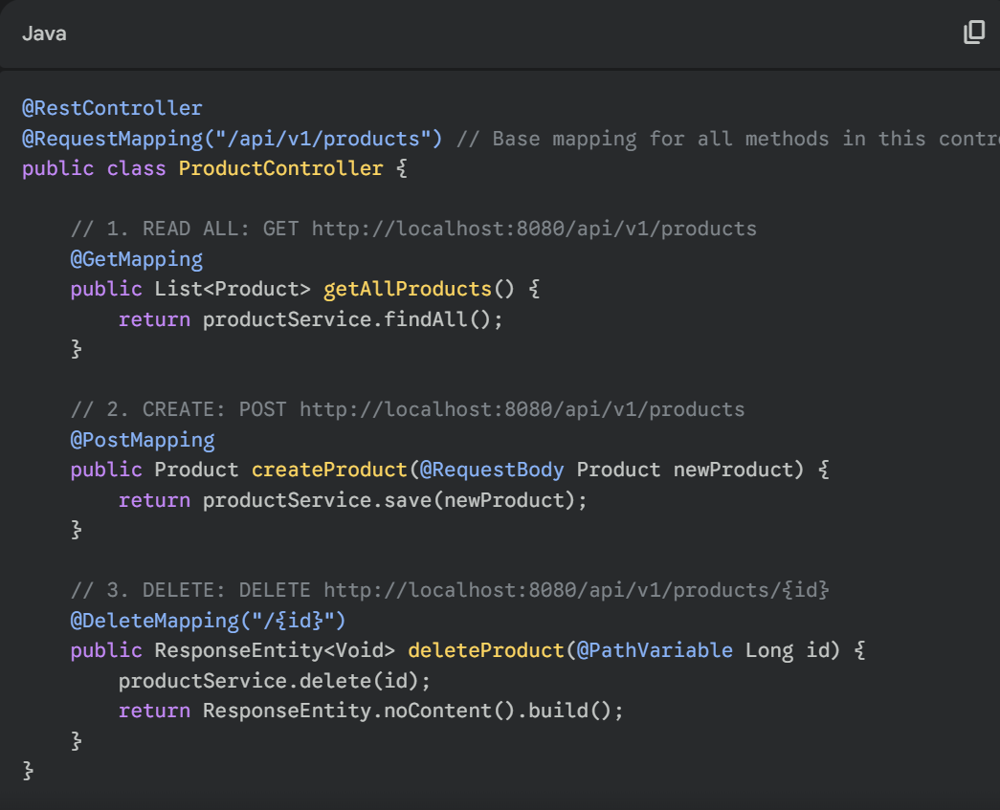

- Create a **class** with corresponding Path using **requestMapping**
- **Within** the class add & **handle HTTP request** Get / Post / Delete etc.. 

 

### Request Body (params in URL)
Understanding method parameters is how you extract data from an incoming HTTP request and map it cleanly to your Java business logic.

#### 1. Extracting Data from the URL Path (@PathVariable) - Dynamic mapping

Using **{}**

You correctly identified that the URL path can contain dynamic elements. The **@PathVariable annotation** is used to extract these values.

- Source: The **dynamic part** of the URL, defined with **curly braces {}** in the mapping.

- Purpose: Ideal for identifying a specific resource (e.g., an ID).

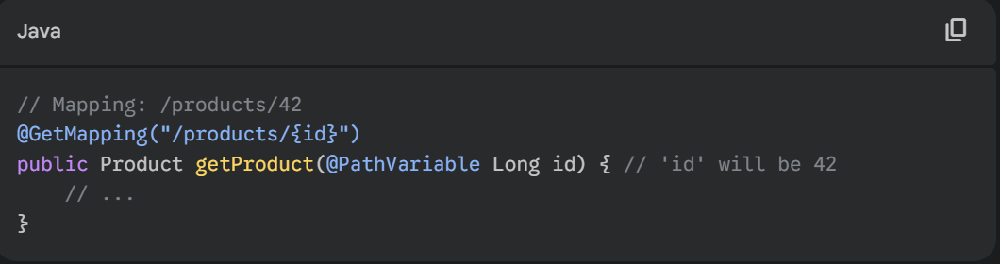

 

#### 2. Extracting Data from the Query String (@RequestParam)

The @RequestParam annotation is used to extract values from the URL's query string 
(the part after the **?**).

Source: Query parameters (e.g., **?search=book&page=2**).

Purpose: Ideal for filtering, sorting, pagination, or optional parameters.

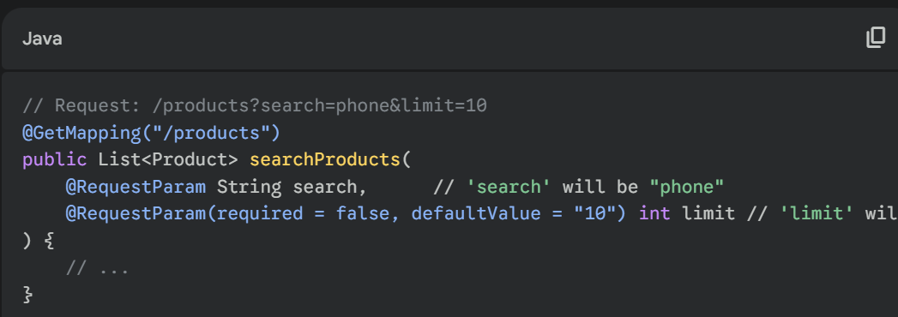
- Each param needs its own **@RequestParam** tag line
- Can use it straightaway in the function method

 

#### 3. Mapping the Request Body (@RequestBody)

The @RequestBody annotation is used to bind the entire HTTP request body (the payload, usually JSON) to a Java object.

- Source: The body of a POST, PUT, or PATCH request.

- Purpose: Used for creating or updating complex resources. Spring uses a message converter (like Jackson) to automatically deserialize the JSON/XML into your Java object.

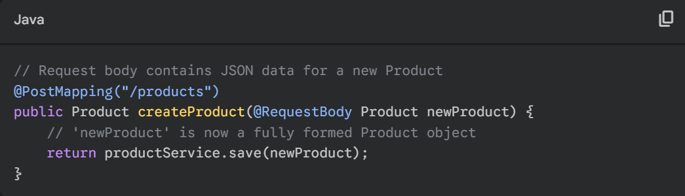

 

#### 4. Accessing Headers and Internal Components
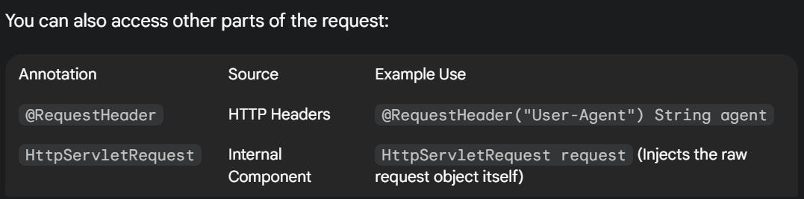

 

### Path creation format (Restful) 

#### 1. Use Nouns for Resources (Not Verbs)
A RESTful API is organized around resources, which are essentially the nouns (objects) of your application (like products, users, or orders). The action (the verb) is handled by the HTTP Method.

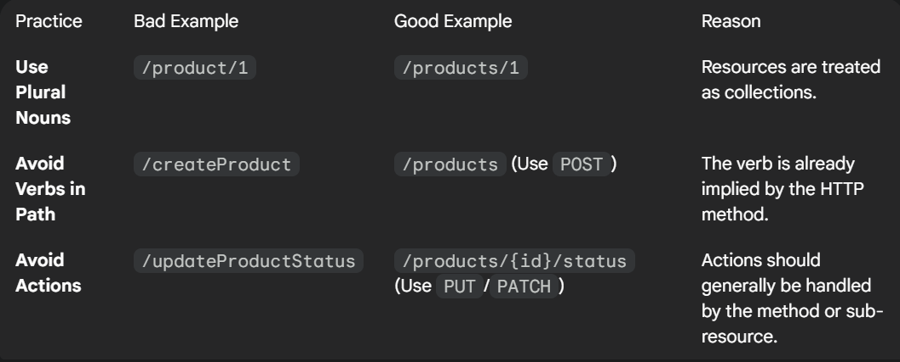

 

### HTTP Status Code Recap

 
______________________________

# IFast Assessment Prepare

## SpringBoot layer Principle / Rule
- DAO
- ResponseModel
- Service
- Controller
- Entity 

## Flow:
Controller → Service → DAO/Repository → Entity → DB
and on the way back, ResponseModel goes outward to the client.

 

## 1️⃣ Controller Layer

✨ Handles incoming HTTP requests.

It receives:

- GET /user

- POST /login

- etc.

It does not contain business logic.

Instead, it delegates to the Service layer.

Analogy: Controller = the receptionist of a company.

#### Good Practice 
###### With Lombok to reduce constructor boiler plate
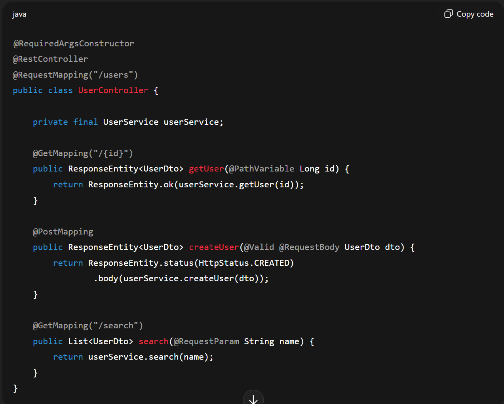

__________________________________________________

## 2️⃣ Service Layer

✨ Contains business logic.

Examples:

- Validate user input

- Apply business rules

- Call multiple DAOs

Combine results

Think of it as “the brains” of the app.

Analogy: Service = the actual worker who knows how to get things done.

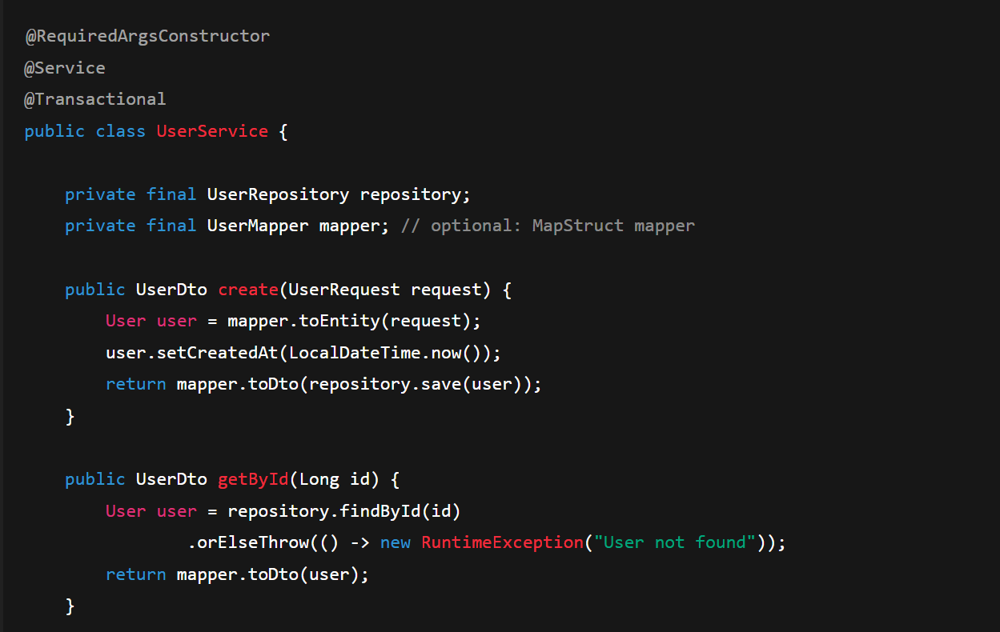

_______________________________________

## 3️⃣ DAO (or Repository) Layer

✨ Talks to the database.

Spring uses:

- JpaRepository

- CrudRepository

This layer does only:

- SELECT

- INSERT

- UPDATE

- DELETE

No logic, only data access.

Analogy: DAO = the storage manager (fetching/saving data).

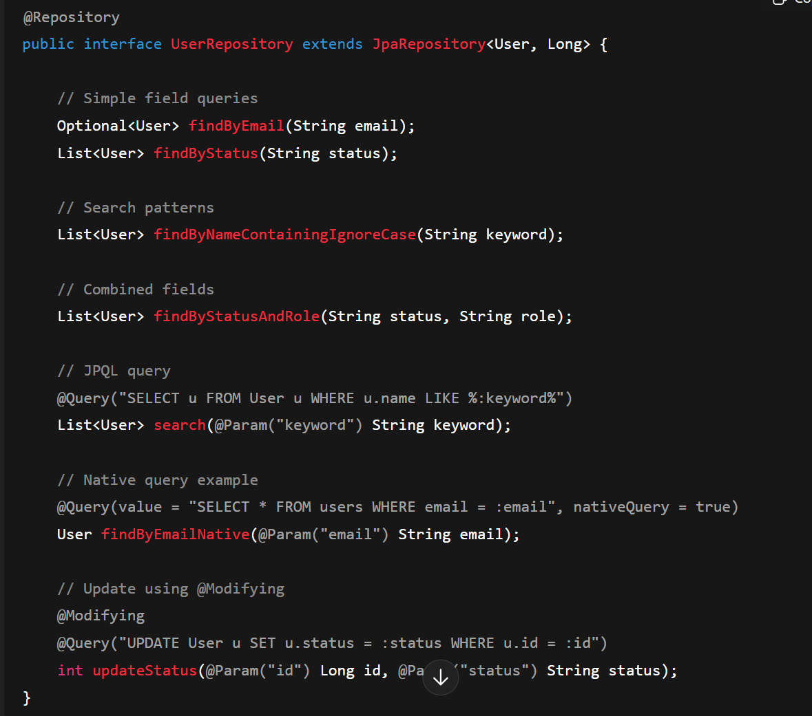

### What is JpaRepository?

JpaRepository is an interface provided by Spring Data JPA.

### What does JpaRepository provide?

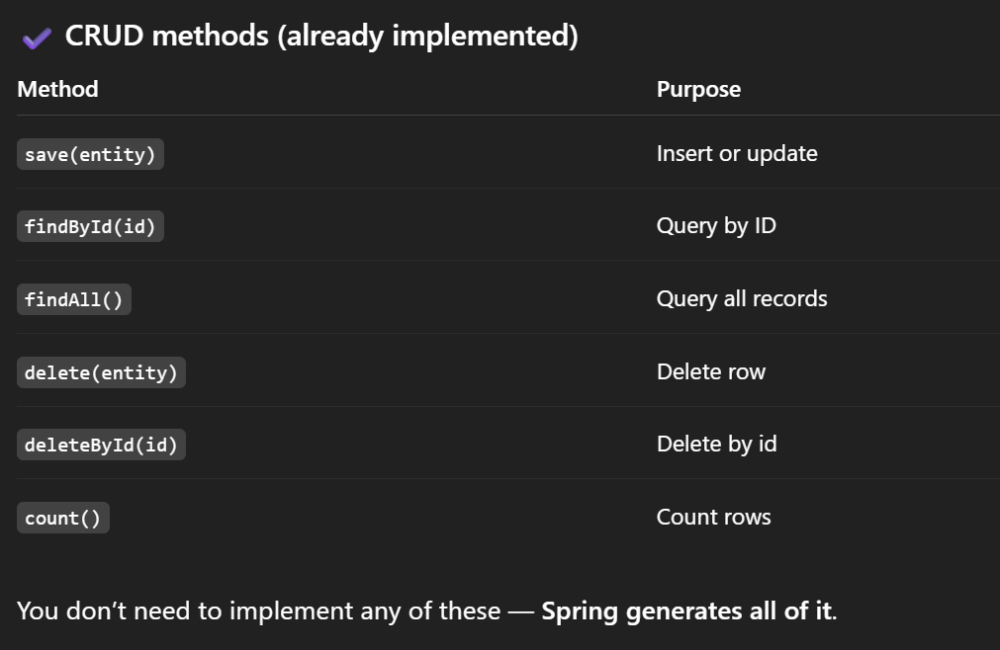

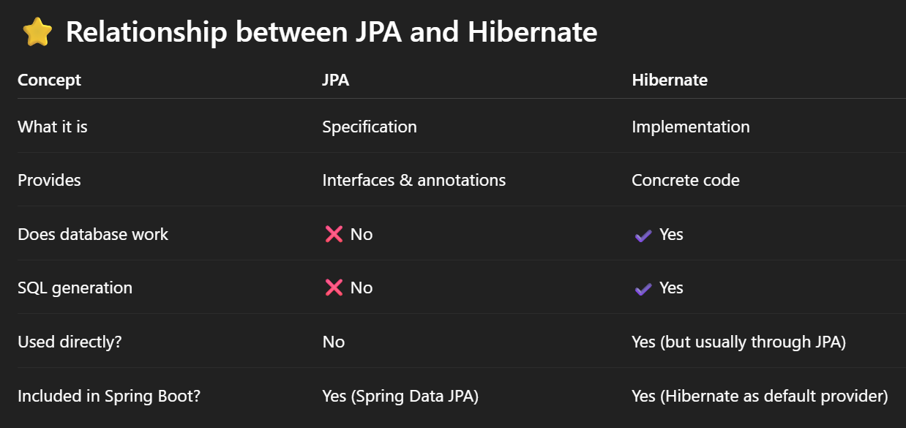

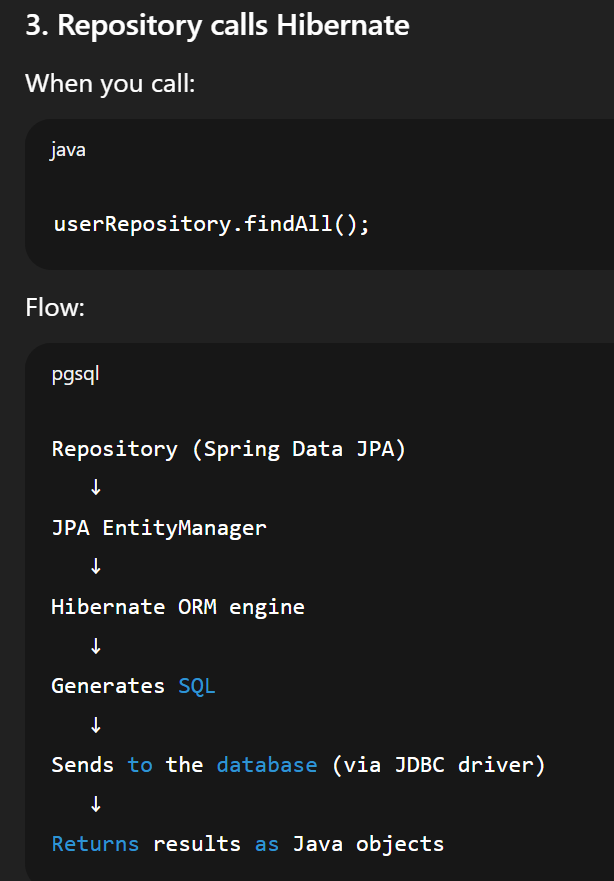

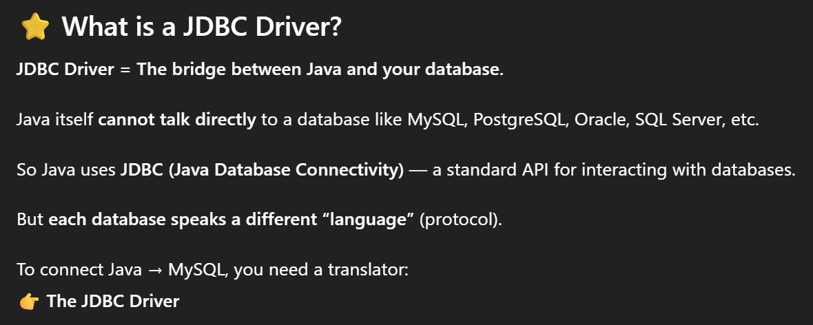

_______________________________

## 4️⃣ Entity Layer

✨ Represents database tables as Java classes.

Example:

@Entity
class User {
   @Id
   private Long id;
   private String name;
}

Each Entity = one table.

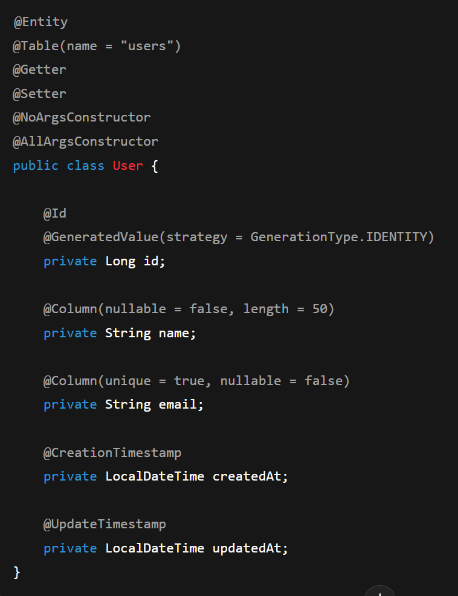

## 5️⃣ ResponseModel / DTO Layer

✨ Defines what you send back to the client.

You do not want to return the Entity directly because:

entity contains internal fields

exposes database structure

DTO is safer & cleaner

class UserResponse {
   private String name;
   private int age;
}

Analogy: DTO = the final packaged item the customer receives.

 

## Data persistence with Spring Data JPA
Goal: connect your app to a relational database and persist data.

Learn about JDBC vs JPA vs Hibernate.

Add spring-boot-starter-data-jpa and H2 (for dev) or PostgreSQL/MySQL for real DB.

Create Entity classes, JpaRepository interfaces, and use @Transactional.

Exercise: convert your Task CRUD API to use JPA with H2. Add simple queries (findByStatus).

Checkpoint: can persist and query entities using Spring Data JPA.

## Security basics

Goal: protect endpoints and understand authentication/authorization.

Add spring-boot-starter-security. Learn about basic HTTP auth and stateless JWT flows.

Understand UserDetailsService, PasswordEncoder, and security filters.

Exercise: protect some endpoints (require login), optionally implement a simple JWT authentication flow.

Checkpoint: can secure endpoints and implement basic auth or JWT-based auth.